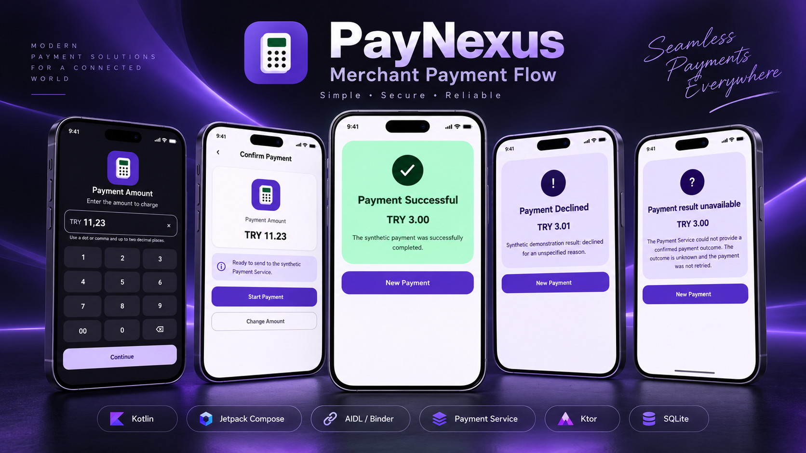
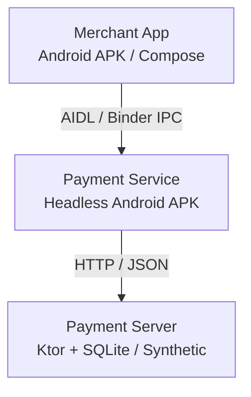

# PayNexus

Synthetic Android payment architecture demonstrating a Merchant app, a separate
headless Payment Service, versioned Binder IPC, and a Ktor/SQLite payment
processor.

[](https://github.com/harunnorhan/PayNexus/actions/workflows/ci.yml)



## Overview

PayNexus is a professional engineering portfolio project that models a small,
synthetic payment-terminal flow. A Jetpack Compose Merchant application delegates
payment work to an independently installed Android Payment Service, which owns
remote orchestration against a Kotlin/Ktor server backed by SQLite.

The project focuses on explicit boundaries and failure semantics rather than
feature count. It demonstrates cross-application IPC, exact monetary values,
idempotent server processing, durable result lookup, and honest handling of
outcomes that cannot be confirmed.

Each explicit payment attempt carries caller-owned payment and idempotency
identifiers across both transport boundaries. Confirmed declines and processing
failures remain business outcomes, while transport or protocol uncertainty is
reported separately as an unavailable result. The Merchant does not automatically
replay an uncertain payment.

## Architecture



Merchant and Payment Service are separate Android APKs. The headless Payment
Service is protected by a signature-level bind permission and exposes a strict V3
asynchronous AIDL/Binder contract. Merchant never calls the Payment Server
directly; Payment Service owns HTTP orchestration, while Payment Server supplies
deterministic synthetic outcomes and local SQLite persistence.

The Merchant owns user interaction and presentation state, not HTTP or server
models. Payment Service validates IPC input, performs bounded off-main-thread
orchestration, and maps only confirmed server responses back into business
outcomes. Payment Server validates HTTP input, applies the deterministic outcome
policy, and treats its SQLite idempotency-key constraint as the authority for
create, replay, and conflict behavior.

Detailed responsibilities and dependency rules are documented in the
[system context](docs/architecture/system-context.md) and
[component boundaries](docs/architecture/component-boundaries.md).

## Engineering Highlights

- Separate Merchant and headless Payment Service Android applications.
- Signature-permission-protected, strict V3 asynchronous AIDL/Binder IPC.
- Exact monetary values represented as `Long` minor units with explicit currency.
- Separate domain, IPC, HTTP DTO, and persistence models with explicit mapping.
- SQLite-backed durable idempotency with stable replay and conflict semantics.
- Bounded ambiguous-outcome recovery through one exact-key result lookup.
- Explicit 5,000 ms HTTP request timeout and automatic redirect refusal.
- Responsive, accessibility-aware Compose UI with a required CI quality gate.

## Demo Flow

The local Payment Server maps TRY minor units deterministically for repeatable
demonstrations:

| Input | Minor units | Result |
| --- | ---: | --- |
| TRY 3.00 | 300 | Approved |
| TRY 3.01 | 301 | Declined / unspecified |
| TRY 3.02 | 302 | Failed / processing error |
| Server unavailable | — | Payment result unavailable; outcome unknown and not retried |

These are synthetic demonstration scenarios, not bank or acquirer authorization.

## Quick Start

Prerequisites: JDK 17, Android SDK Platform 37, a running API 37 emulator, and
`adb` on `PATH`.

Start Payment Server from the repository root. The external database path keeps
local runtime data out of the working tree:

```bash
PAYNEXUS_PAYMENT_DB_PATH=/tmp/paynexus-demo.db \
  ./gradlew :server:application:run
```

In another terminal, install Payment Service before Merchant, then launch
Merchant:

```bash
./gradlew :apps:payment-service:installDebug
./gradlew :apps:merchant:installDebug
adb shell am start -n com.paynexus.merchant/.MainActivity
```

Submit TRY 3.00, 3.01, or 3.02 to exercise the deterministic outcomes above.
The debug Payment Service connects from the Android emulator to the host server at
`http://10.0.2.2:8080`.

Release builds intentionally configure no Payment Server endpoint and therefore
fail closed instead of embedding a production destination. The local command is a
development demonstration, not deployment guidance.

## Verification

The recorded PNX-027 baseline contains 266 passing automated tests across Payment
Service, Merchant, server, IPC contract, and payment domain suites. Repository
`qualityCheck` and `build` also passed at that baseline.

Local runtime verification on an API 37 arm64 emulator exercised the real
Merchant → Binder V3 → Payment Service → HTTP → Payment Server → SQLite path. It
covered approved, declined, and failed outcomes; unavailable Service and Server
behavior; lifecycle abandonment; SQLite persistence across restart; same-intent
replay; idempotency conflict; and unknown lookup.

PNX-028 runtime visual and responsive verification passed across representative
payment states, dark mode, large font, compact and landscape layouts,
service-unavailable behavior, state reset, and basic accessibility semantics.
Exhaustive TalkBack traversal was not performed. PNX-029 separately verified
launcher and branding rendering on an API 37 emulator.

Ambiguous POST recovery, the real 5-second timeout path, and redirect refusal have
deterministic automated coverage but were not manually exercised at runtime.
See the [testing strategy](docs/engineering/testing-strategy.md) for the complete
evidence and limitations.

For a fresh local verification, run:

```bash
./gradlew spotlessCheck
./gradlew detekt
./gradlew qualityCheck
./gradlew build
```

Pull requests targeting `main` must pass the repository's `Quality and Build`
status check.

The current verification evidence is deliberately scoped: it proves the recorded
local simulation behavior and repository gates, not production availability,
distributed durability, acquiring correctness, or certification.

## Documentation

Start with the [documentation index](docs/README.md), or go directly to:

- [Project charter](docs/project/project-charter.md)
- [System context](docs/architecture/system-context.md)
- [Component boundaries](docs/architecture/component-boundaries.md)
- [Architecture decision records](docs/adr/)
- [Engineering principles](docs/engineering/engineering-principles.md)
- [Testing strategy and verification evidence](docs/engineering/testing-strategy.md)
- [Design system](docs/design/design-system.md)

## Scope / Limitations

PayNexus uses synthetic payment data and a deterministic mock processor. It does
not process real cards, integrate with banks or acquirers, provide production
acquiring, or claim PCI DSS compliance or production security certification.

SQLite provides local, single-process durability for this demonstration. The
project does not claim distributed idempotency, exactly-once external financial
execution, a production SLA, or guaranteed remote cancellation.
